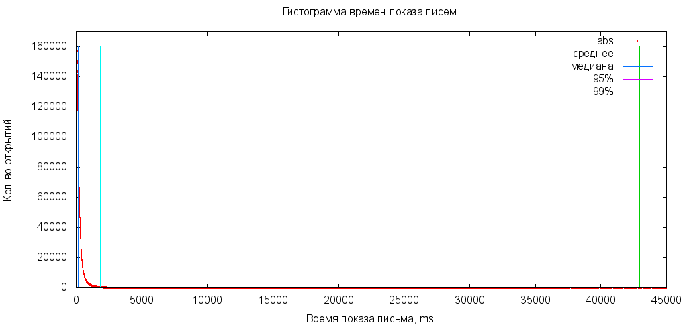
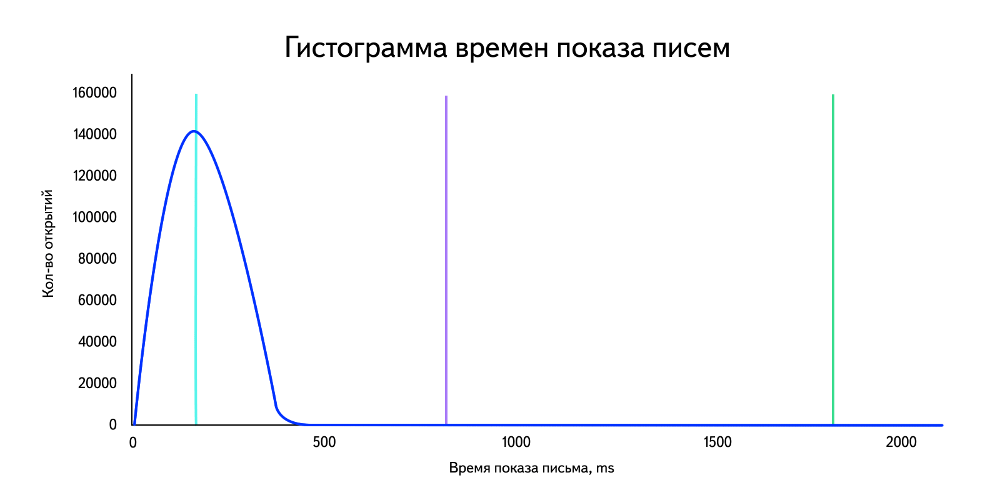
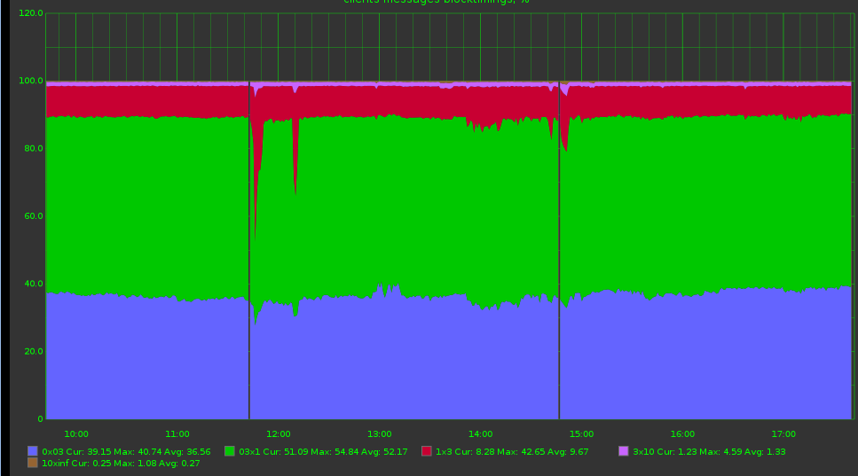

---

layout: ribbon

style: |

    #Cover h2 {
        margin:30px 0 0;
        color:#FFF;
        text-align:center;
        font-size:70px;
        text-shadow: 1px 1px 1px #000;
        }
    #Cover p {
        margin:10px 0 0;
        text-align:center;
        color:#FFF;
        font-style:italic;
        font-size:20px;
        text-shadow: 1px 1px 1px #000;
        }
        #Cover p a {
            color:#FFF;
            }
    .white_caption h2,
    #Picture h2,
    #big_brother h2
    {
        color:#FFF;
        }
    #SeeMore h2 {
        font-size:100px
        }
    #SeeMore img {
        width:0.72em;
        height:0.72em;
        }
---

# Стоимость SPA-продедур {#Cover}
{:.cover.w}

*Алексей Андросов, Яндекс.Почта*

<!-- photo by John Carey, fiftyfootshadows.net -->

## **У меня все тормозит!!11**

// Обычно с такой фразы начинается любая работа
// Но к этому надо походить не наскоками, а построить целый процесс
// И сейчас я вам покажу как это сделать
// Мой доклад не будет про фреймворки, они будет про методологию

## Методология

1. Собери **<mark>факты</mark>**
2. Проанализируйте факты
3. Постройте теорию
3. Поменяйте **<mark>один!!!!</mark> участок кода**
4. Проверьте теорию

## **Вам не нужны статьи "10 советов..."**

## **Вам нужны инструменты!**

## Без инструментов

* оптимизации нельзя увидеть
* не отследить влияние на реальных пользователей
* нельзя построить процесс и следить за состоянием приложения

// Очень важно, чтобы оптимизация не была единоразовой или от случая к случаю.
Над метриками скорости надо организовывать процесс.
Для начала хватит реалтаймовых графиков и тестирования каждого релиза на скорость.
Таким образом, мы останемся честными сами с собой и будем понимать, где именно мы медленные.
Налаженный процесс позволяет отслеживать релизы, в которых произошли изменения в скорости, а значит, мы точно сможем это исправить.
Даже если у вашей команды нет времени целенаправленно и постоянно заниматься оптимизацией, можно хотя бы следить за тем, чтобы не становилось хуже.

## **Сколько стоит SPA-услуга**

## Собираем факты

В идеале нужно уметь измерять любой сценарий пользователя "от клика до реакции на это действие".

Для этого пригодится единый API "сделай что-то и перерисуй страницу".

// конкретная реализации зависит от фреймворка, но это всегда можно сделать
// единый API позволит вам контроллировать метрики в одном месте, а не расставлять их везде вручную

## Что нужно мерить

* подготовка к запросу на сервер (от действия пользователя до запроса)
* запрос данных с сервера
* шаблонизация
* обновление DOM
* обработка событий у view
* выполнение callback «после отрисовки»
* &nbsp;**то, что нужно вам**

## Что нужно мерить

Каждую стадию и общее время на измерять отдельно. Если общее время считать как сумму микро-метрик,
то вы рискуете потерять что-то важное.

Если общее время и сумма метрик не совпадает, значит у вас не считается какая-та стадия.

## **А теперь посчитаем среднее!**

## &nbsp;
{:.cover.w}

## &nbsp;
{:.cover.w}

## Медиана

Медиана – это серединное, а не среднее значение в выборке.
Если у нас имеются числа 1, 2, 2, 3, 8, 10, 20, то медиана – 3, а среднее – 6,5.

Она хорошо отсекает слишком плохие или слишком хорошие данные.

## Процентиль

Строим график по группам. Например

* 0 - 100мс
* 100мс - 500мс
* 500мс - &#8734;

## &nbsp;
{:.cover.w}

## А еще хорошо следить за клиентом
{:.cover.w.h #big_brother}

## Как отслеживать клиента

Случайное генерируем ключ, который выдается при загрузке SPA и идентифицирует его сессию (session_id).

Его надо пробрасывать во всех запросах во все бекенды.

В каждый запрос еще можно добавлять ID(request_id).

## Зачем все это надо?!

1. Отличаем действия вкладки/браузера/устройства одного пользователя.
2. Легко отследить всю цепочку браузера->бекенд1->бекенд2->бекендN->БД.
3. Легко собрать всю сессию пользователя и понять что пошло не так.

## **Анализ**

## Анализ и построение теории

Во-первых, надо четко понимать какие цифры вы считаете хорошими, а какие плохими.

Вот страница рисует за 500мс. Это хорошо или плохо?

А если я потрачу день и будет 450мс?

// У каждой оптимизации есть стомость
// Важно понимать, что она вам принесет
// Поэтому не стоит ударяться в крайности и делать ненужную работу

## Анализ и построение теории

* Найдите часть, которая вас не устраивает
* Поставьте цель - скорость, которая бы вас устривала

// Причем нельзя говорить 100мс
// Вы живете в диком интернете и всегда будет что-то не так
// Цель - 90% людей в 100мс

## **Как искать проблему?**

## **Профайлер вам не поможет!**

## Профайлер вам не поможет!

Профилировать запуск обновления SPA, в котором были сделаны десятки тысяч вызовов JS-функций немного сложновато...

Туда неизбежно попадут внутрении вызовы фреймворка, о которых вы ничего не знаете и не контроллируете.

А еще проблама в том, что сложно отследить к какому именно блоку относятся вызовы.

## Как искать проблему?

Вам помогут метрики стадий, чтобы узнать где большего всего потеряли время.
Фреймворки иногда имеют встроенные метрики производительности.

Надо проектировать сценарии в тестах так, чтобы избежать внешнего влияния.
Можно отключать какие-то виды и смотреть насколько ускоряется приложение.

// В больших SPA куча видов и на одной странице их может быть очень много.
// Поэтому важно проектировать тест, чтобы измерять скорость того вида, который вам нужен.
// Виды можно просто убирать со страницы или как-то отключать их от обновления

## Как искать проблему?

Не ленитесь и потратьте 10 минут времени на написание скрипта, который выполнит нужный вам сценарий действий.

Это сэкономит вам часы безтолкового кликанья по кнопкам и снятия метрик.

А еще даст возможность запускать этот сценари сколько угодно раз!

## Инструменты в популярных фреймворках

* [React Performance Tools](http://facebook.github.io/react/docs/perf.html)
* [Angular Batarang](https://github.com/angular/angularjs-batarang)

## Что не надо оптимизировать?

Микрооптимизации в реальных приложениях почти никогда ничего не дают.

Оптимизируйте то, что реально тормозит, а не то, что вы думаете, что тормозит!

## Поставьте пределы

Например, не стоит делать оптимизацию, если она будет меньше 20мс или 10%.

Я хочу вас уберечь от бессмысленного проведения дня на jsperf и слов "Я тут заменил везде forEach на for и теперь все работает на целых 5мс быстрее!"

## **Немного советов**

## Как мерить микрооптимизации

Иногда видно, что происходит тысячи вызовов микрофункции и это занимает много времени.

Как же померить ее скорость?

## Как мерить микрооптимизации

1. Проверить скорость разных варинтов реализации на [jsperf.com](http://jsperf.com/)
2. В своем приложении измеряем через [performance.now()](https://developer.mozilla.org/en-US/docs/Web/API/Performance/now)

## Как мерить микрооптимизации

    var sum = 0;

    function myFn() {
        var start = performance.now();
        callMicroFn();
        var end = performance.now();
        sum += (end - sum);

// Date.now не позволит вам измерить функции, который исполняются в районе 1ms
// Это можно сделать performance.now и т.о. посчитать сколько времени этот вызов занимает в вашем приложении
// рассказать про случай с lazy

## **Оптимизация методом замедления**

## WAT??

Очень часто надо оптимизировать небольшие элементы страницы. Скажем, по 10мс каждый.

Если вы случайно сделаете 9мc, то не поймете это погрешность или оптимизация.

## Замедлеяем элементы

Техника очень простая - сделайте одно и тоже действие много раз.

Например, вместо 20 элементов коллекции отрисуйте 200 или 1000.

{:.note}
Единичный элемент страницы - это просто коллекция с одним элементов :)

## Замедлеяем элементы

Важно понимать, что скорость **должна** увеличиваться как минимум линейно.

Если это не так, то большой список не отрисуется никогда.

// Если 20 элементо рисуются за 100мс
// А 100 за секунду (увеличение времени не в 5 раз, а в 10)
// Значит что-то у вас не так
// 200 элементов уже отрисуются секунд за 5

## Замедлеяем элементы

Допустим, у нас есть стадии:

1. Подготовка
2. Шаблонизация
3. Выполнение каллбеков

Увеличивая количество элементов, можно увидеть какая стадия растет непропорционально. В ней и заключается проблема!

## **Закончили анализы**

## Что получили?

У нас есть метрики и мы нашли **возможное** место, которое тормозит.

Мы его даже как-то оптимизировали. Как проверить?

## **Проверяем теорию**

## Только не на локалке!!1
{:.cover.w.h.white_caption}

## Проблемы локалки

1. Нечестное окружение
1. Влияние несжатого или нескомплированного кода (JIT, инлайниг)
1. В дев-окружении обычно больше логов
2. У вашего соседа будут другие результаты
3. Завтра вы не сможете повторить свой же результат

// У вас явно не тот почтовый ящик, что у среднего пользователя.
// На локалке или разработческом стенде все может работать по-другому. В дев-почте например есть динамическая локализации,
// а в проде статическая.
// Несжатый код влияет на JIT и инлайнинг. Поэтому результаты могут быть разные.
// Банально один и тот же тест может выполняться с очень большим разбросом по времени.
// У вас сегодня запущено много всего, завтра много другого, результаты всегда разные.

## Что нужно делать на локалке?

Нужно профилировать и искать проблемные места.

Но проверять эффективность оптимазации можно только на независимом стенде (или в продакшене на реальных логах).

## Зачем нужен тестовый стенд?

1. Дает чистое окружение
2. Уменьшает внешнее воздействие
1. Оптимизации должны быть воспроизводимыми и стабильными. *Никакого разброса от 50 до 500мс.*{::}
1. Оптимизации должны появиться у реальных пользователей, а не у вас на локалке.
1. Надо много раз запускать один и тот же тест в разных браузерах

// Т.о. задача тестового стенда и тестировщиком максимально приблизиться к реальному окружению.

## Как сделать тестовый стенд

Берем два одинаковых сервера.

Один с прод-окружением, другой - с тестовым пакетом.

Запускаем одни и те же сценарии, сравниваем результаты.

// Очень важно иметь имеено две одинаковые машины, чтобы не делать скидки и поправки на разницу.

## Что делает тест?

1. Открыть браузер
2. Открыть SPA
3. Сделать нужные операции
4. Операции отправляют метрики
5. Закрыть браузер

## Что делает тест?

Прогоняем эти шаги, скажем, 50 раз.

Считаем медиану и процентили по метрикам.

Это и есть показатель эффективности оптимизации.

## Как отслеживать продакшен?
{:.cover.w.white_caption}

## Как не утонуть в графиках

Вы уже научились мерить скорость приложения и построили кучу графиков.

Чтобы в них не утонуть, вам нужен APDEX

## APDEX

[APDEX](https://en.wikipedia.org/wiki/Apdex) – интеграционная метрика, которая сразу говорит: хорошо или плохо.

Значение от 0 до 1, по сути индекс удовлетворенности пользователей.

## APDEX

Выбираем временной интервал [0; t] - пользователь счастлив.

Берем еще один интервал (t; 4t] - пользователь удовлетворен.

APDEX = (количество счастливых пользователей + количество удовлетворенных/2) / (количество всех пользователей).

## APDEX

1. Вместо непонятных цифр дает четкий ответ
2. Можно обрабатывать автоматически
3. Может агрегировать разные графики

{:.note}
Но не отменяет детальных графиков.

## **one more thing**

## В метриках бывают ошибки :)

Если графики ровные, а пользователи жалуются, значит у вас ошибки в метриках.

Чтобы такого не было, надо устраивать стресс-тестирование.

Замедляйте код, добавляйте timeout, генерируйте ошибки и смотрите как меняются цифры.

## В заключении

1. Собери факты
2. Проанализируйте факты
3. Постройте теорию
3. Поменяйте один участок кода
4. Проверьте теорию

## В заключении

Постройте графики и наладьте процесс вокруг анализа скорости.

Не делайте ничего на абум, цените свое время.

Следите за жизнь проекта со стороны пользователя, а не из консоли браузера.
